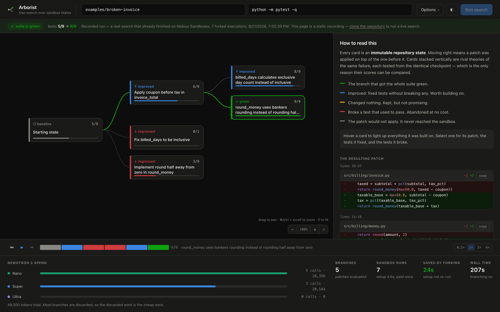

# Arborist

**A coding agent that repairs a failing repository by searching a tree of sandbox states instead of walking one line of attempts.**

[](https://github.com/ZNLong2203/Nebius-Nvidia/actions/workflows/ci.yml)
[](https://znlong2203.github.io/Nebius-Nvidia/)
[](LICENSE)

**[Open the live demo →](https://znlong2203.github.io/Nebius-Nvidia/)** — a real search, recorded on Nebius Sandboxes. Every branch is clickable: its hypothesis, its patch, the tests it fixed and the tests it broke.



Built for the [Nebius x NVIDIA Global AI Hackathon](https://nebiusglobalaihackathon.devpost.com/) — *Coding and Agentic Engineering* track. Runs on **Nebius Token Factory**: NVIDIA **Nemotron 3** for every model call, **Nebius Sandboxes** for every execution.

---

## The problem

Every coding agent shipping today is a straight line:

```
edit → run tests → read the failure → edit again → run tests → …
```

That shape has three costs that nobody talks about:

1. **Backtracking is destructive.** When attempt #3 makes things worse, the agent has to *undo* — and in the meantime it has been reasoning on top of a repository it already damaged. Most agents simply carry the damage forward.
2. **The expensive prefix is paid over and over.** Clone, `pip install`, build, warm the cache — a container-per-attempt agent repeats all of it for every single candidate patch.
3. **Rival theories are never compared.** A bug usually has two or three plausible explanations. A linear agent picks one, commits to it, and never finds out that the second one was right.

## The idea

Treat repair as **search over immutable repository states**.

Nebius Sandboxes gives every executed command a new, immutable filesystem version, and lets you **fork from any of them** — Git branching, but for container execution state. That single primitive turns all three costs into non-problems:

```
    [ repo + deps installed + tests run ]     ← the expensive prefix, paid ONCE
                     │
      ┌──────────────┼──────────────┬──────────────┐
      ▼              ▼              ▼              ▼
  hypothesis A   hypothesis B   hypothesis C   hypothesis D     ← forked in parallel
  5/9 passing    7/9 passing    5/9 · BROKE 2  patch invalid
      ✗              ★               ✗           (never ran)
                     │
          ┌──────────┴──────────┐
          ▼                     ▼                              ← the winner becomes
   next hypothesis       next hypothesis                          the next fork point
     9/9 ✓ green            7/9 neutral
```

- **Breadth**: four rival theories of one bug, each tested from *the same* starting state — so their scores are genuinely comparable.
- **Depth with free backtracking**: a partial fix that repairs two of three failures becomes the base for the next attempt. If that attempt regresses, the partial fix is still sitting there untouched, because nothing was ever mutated.
- **Cost**: with `k=4` candidates across 3 levels, a container-per-attempt agent pays the setup cost 12 times. Arborist pays it once.

## What it produces

Not just a patch — **a patch plus the record of what was rejected and why**, opened as a pull request:

```
fix: round_money uses banker's rounding + 2 more (4 failing tests)

Repairs the failing suite: 5/9 → 9/9 passing.

## Alternatives considered (2)
▸ → pct() loses precision before rounding — no test changed state
▸ ✗ the test encodes the wrong expectation — tests/test_billing.py: search block not found
```

Every branch the search explored is in that body, folded away but present, with the test-level reason it lost. A reviewer can see that the agent *considered* weakening the assertion and why that attempt was thrown out. No coding agent ships that today, and it is the difference between trusting a diff and being able to check one.

**A real one: [pull request #1](https://github.com/ZNLong2203/Nebius-Nvidia/pull/1)**, opened by `arborist pr` from the demo run above. Three files, six lines added, four removed — the three fixes and nothing else — and under *Alternatives considered*, the two branches that broke passing tests, each with the tests it broke. It targets a `demo/` branch so the fixture stays broken on `main`.

---

## How NVIDIA Nemotron is used

Three tiers, chosen by what each step is worth. This is the core cost argument, and the run report prints the token counts so it stays checkable.

| Tier | Model | Called | Why this tier |
|---|---|---|---|
| **Nano** | `nvidia/NVIDIA-Nemotron-3-Nano-30B-A3B` | Once **per candidate patch** — the widest step in the whole system | Most branches are thrown away. The work that gets discarded must be the cheap work. |
| **Super** | `nvidia/nemotron-3-super-120b-a12b` | Once **per node**, to diagnose the failure and produce *distinct* hypotheses worth branching on | This is the reasoning that shapes the search. Getting hypotheses that genuinely differ is what makes breadth worth paying for. |
| **Ultra** | `nvidia/Nemotron-3-Ultra-550b-a55b` | When the search **stalls** (two expansions with no improvement) — and for every diagnosis after that until something improves — or when two branches score **identically** | Expensive, so it is earned, not scheduled. A search that keeps making progress barely touches it: 29 Ultra calls across 35 branching runs, against 196 in the 35 linear runs. |

The Ultra tie-break is the interesting one. When the tests cannot separate two branches, the suite has stopped being informative — and that is exactly the situation where one of the patches is *gaming* it. Ultra is asked specifically to catch a patch that passes by weakening an assertion, swallowing an exception, or special-casing the test input, and to flag it rather than let the score stand. See [`arborist/agent.py`](arborist/agent.py) (`ADJUDICATE_SYSTEM`).

All three are served through **Nebius Token Factory**'s OpenAI-compatible endpoint, with `response_format: json_schema` for every structured step.

## How Nebius Token Factory and Sandboxes are used

| Service | Where |
|---|---|
| **Token Factory — inference** | Every Nemotron call, via `https://api.tokenfactory.nebius.com/v1/`. One base URL, three models, no per-model plumbing — swapping a tier is a one-line change in [`arborist/config.py`](arborist/config.py). |
| **Token Factory — structured output** | `json_schema` response format on diagnosis, patch generation and adjudication, with a lenient recovery parser behind it ([`arborist/llm.py`](arborist/llm.py)). |
| **Token Factory — Sandboxes (ConTree)** | Every command execution. The Git-like branching *is* the product: `base()` builds the prefix, `run()` forks from any checkpoint, `read()` pulls the JUnit report back out of a specific state. See [`arborist/sandbox.py`](arborist/sandbox.py). |
| **Tavily** | Consulted when the diagnosis implicates a third-party package, asks for documentation, or reports low confidence in itself. The middle trigger was added after a measurement: on the `outside-knowledge` case Nemotron was confident, never asked, and never searched — because **a model is confidently wrong about a library exactly when its training snapshot predates the version in the repository**, and it cannot know it is in that case. One lookup costs less than one wrong patch and the sandbox execution behind it. A confident, repo-local diagnosis still never touches the network. See [`arborist/tools/tavily.py`](arborist/tools/tavily.py). |

### Where Token Factory accelerated the build

- **One endpoint, three model sizes.** The tier experiment — which step can drop to Nano, which needs Ultra — was a config edit, not an integration. That experiment *is* the project; on a single-model provider it would not have been affordable to run.
- **Sandboxes removed the part that usually eats the whole build.** Safe execution of model-written code with forkable state is normally weeks of container plumbing. It is four method calls here.
- **`json_schema` output removed the parsing layer.** Patch edits arrive as validated objects, so a malformed patch costs tokens and never a sandbox execution.

---

## Quick start

Python 3.11 or newer.

```bash
git clone https://github.com/ZNLong2203/Nebius-Nvidia.git
cd Nebius-Nvidia
python -m venv .venv && source .venv/bin/activate
pip install -e ".[contree,dev]"

cp .env.example .env     # add NEBIUS_API_KEY (and TAVILY_API_KEY if you have one)
pytest -q                # 168 tests, no key needed — everything runs offline
```

Get a key at [tokenfactory.nebius.com](https://tokenfactory.nebius.com). Hackathon participants get $25 in credits with the code `NEBIUS-DEVPOST-GLOBAL26`.

`.env.example` starts on the **local** backend, which runs commands in directory
snapshots and needs nothing but an inference key, so a fresh clone works
immediately. Nebius Sandboxes — the backend this project is built around — is in
Beta and granted per project; set `ARBORIST_BACKEND=contree` once you have it,
and the backend will tell you plainly if you do not. See
[docs/sandboxes.md](docs/sandboxes.md).

### Repair the bundled broken repository

`examples/broken-invoice` is a billing module with **three unrelated bugs** across three files and **four red tests** — rounding, order of operations, and an off-by-one:

```bash
arborist fix examples/broken-invoice \
  --test "python -m pytest -q" \
  --setup "pip install -q -r requirements.txt" \
  -k 4
```

You get a live tree in the terminal, then the winning diff, the token spend per tier, and a JSON report in `runs/`.

### Repair against an issue, with the tests locked

```bash
arborist fix path/to/repo --goal @ISSUE.md --protect "tests/*"
```

`--goal` puts the issue text in front of every model call. `--protect` refuses,
before it runs, any patch that edits a matching file — so a green suite means
the code was fixed, not the tests rewritten to agree with it. It is how the
[SWE-bench runs](evals/swebench/README.md) keep the benchmark's tests as the
judge.

### Watch it search

```bash
docker compose up --build     # http://localhost:8000 — builds the UI too
```

Or without Docker:

```bash
cd web && npm install && npm run build && cd ..   # optional: the full interface
arborist serve                                     # http://127.0.0.1:8000
```

The tree draws itself over server-sent events while the search runs: branches open, score, and get abandoned in real time. Click any node for its hypothesis, its patch, which tests it fixed, and which it broke. Starting a run puts `?run=<id>` in the URL, and that link replays the whole search for anyone you send it to.

Without the build step the service serves [`ui/index.html`](ui/index.html) instead — one file, no dependencies, same API — so a fresh clone works immediately.

### Open it as a pull request

```bash
arborist pr runs/run-xxxxxxxx.json --repo .          # dry run: prints the plan and the body
arborist pr runs/run-xxxxxxxx.json --repo . --open   # branch, commit, push, gh pr create
```

Dry run by default. Creating a branch needs `--yes`; pushing and opening the pull request are separate opt-ins on top of that. `arborist report <run.json>` prints the same body without touching git.

### Compare against a linear agent

```bash
arborist fix examples/broken-invoice --no-branching --setup "pip install -q -r requirements.txt"
```

Same models, same prompts, same budget — one hypothesis at a time, and no checkpoint to fork, so the setup command runs again on every attempt. That is the baseline.

---

## Measuring it

```bash
python evals/run_eval.py --cases all
```

Runs every case under an identical budget, branching on and off (`--repeat N` for more runs), and writes `evals/results.md` with: solved yes/no, tests passing before and after, patches evaluated, sandbox executions, **how many times setup had to run**, invalid patches, wall time, and tokens per tier.

Four cases ship: the bundled example and three in `evals/cases`. The answer keys live in [`evals/README.md`](evals/README.md),
never inside a case — anything inside is loaded into the agent's context, and a
demo that reads its own answer key proves nothing.

`--model-set matched-baseline` reruns the same cases on size-matched non-NVIDIA
models from the same Token Factory account (Qwen3 30B A3B against Nemotron 3
Nano 30B A3B, gpt-oss 120B against Super), so a model comparison changes the
model and nothing else.

### What the numbers show

Measured on Nebius Sandboxes by the [Measure workflow](.github/workflows/measure.yml),
every number from one commit (`7b11e3d`). Both arms get the same models, prompts,
budget and tests — fan-out 3, 12 nodes; linear means one hypothesis at a time.

**Where a bug needs exploring, the search wins outright** ([`evals/results-contree.md`](evals/results-contree.md)):

| case | branching | linear | what the case is |
|---|---|---|---|
| `broken-invoice` | **3/3** | 0/3 | three independent bugs in three files |
| `masked-faults` | **2/3** | 0/3 | a fault hidden behind another; the obvious fix moves nothing |
| `regression-trap` | **3/3** | 3/3 | one patch is enough |
| `outside-knowledge` | **3/3** | 3/3 | one patch is enough, once the docs are looked up |
| **all** | **11/12** | 6/12 | |

Branching solved **nearly twice as many runs**, ran the environment setup **12
times against 86** — once per run, as designed — and spent **60% less** on models.

`masked-faults` shows why. An import error stops the suite collecting, so two
further faults give no signal until it is repaired; then the obvious fix — the
one the failing test is named after — moves nothing, because a second fault still
hides the rows that would prove it. The [branching tree](https://znlong2203.github.io/Nebius-Nvidia/?run=run-02b4f440)
put three rival repairs on one checkpoint: the obvious one came back **neutral**,
its sibling reached 3/4, and the next fork from the sibling went green. The
[linear tree](https://znlong2203.github.io/Nebius-Nvidia/?run=run-1fd073c5) spent
ten of its twelve patches retrying the right theories on one state, and every one
that applied regressed the suite back to a collection error. With no sibling
evaluated from the same state, it could not tell a wrong theory from a wrong
implementation of a right one.

**On real open-source repositories, the same fixes at a third of the cost.**
SWE-bench Lite: 23 issues from flask, seaborn and pytest, run inside the
benchmark's own evaluation images on Sandboxes, every fix re-verified from a
clean checkout ([`evals/swebench/results.md`](evals/swebench/results.md)):

| | resolved | patches (median) | wall (median) | model cost |
|---|---|---|---|---|
| **branching** | 14/23 | **3** | **257 s** | **$1.94** |
| linear | 15/23 | 6 | 449 s | $5.84 |

A search resolved 61% of real issues with half the patches, 43% less time and a
**third of the spend**. A linear agent that stalls keeps escalating to the most
expensive model; a search that keeps finding progress rarely needs to — 29 Ultra
calls across all 35 branching runs, against 196 for linear. (The agent sees the
issue and its failing tests; method in [`evals/swebench/README.md`](evals/swebench/README.md).)

**Model-agnostic by construction.** The same search with size-matched models from
the same Token Factory account — Qwen3 30B A3B, gpt-oss 120B, Qwen3 235B in the
three tiers — solved all 12 small-case runs too
([`evals/results-contree-baseline.md`](evals/results-contree-baseline.md)). The
search and the tiering are not tied to one model family: they work with
whichever models fill the tiers.

**A fair fight.** Five ways the harness had favoured branching were found and
removed before these numbers: both arms get the same node budget with no
depth cap on the linear arm, the same number of attempts per state, revisits
instead of early stops, and setup runs that are counted, not estimated.

**Two engineering choices that mattered as much as the search.** Patches are
validated before they run — a failed one gets a single repair attempt with the
reason fed back, which took unusable patches from 3-of-5 to 0-of-8 — and scoring
compares the parent's *test identities*, so a trade that fixes two tests and
breaks one shows up as the regression it is, not as progress.

> Every results table is checked in, stamped with the commit that produced it
> (`evals/results*.md`), and the run trees behind the claims are in
> [`evals/evidence/`](evals/evidence/). Rerun them with the command above.

---

## How it works

```
arborist/
  config.py       model tiers, budgets, settings
  llm.py          Token Factory client, per-tier token accounting, JSON recovery
  sandbox.py      Backend contract · ContreeBackend (Nebius) · LocalBackend (offline)
  agent.py        the three prompts: diagnose → propose → adjudicate
  search.py       selection, scoring, expansion, backtracking
  repo.py         repo IO, patch application, JUnit parsing, diffing
  tools/tavily.py external-knowledge lookup
  server.py       HTTP API + SSE event stream
  cli.py          terminal interface
web/              the interface: Next.js, exported to static files
ui/index.html     dependency-free fallback UI (no build step, no CDN)
```

The loop, once per iteration:

1. **Select** the highest-scoring unexpanded node, shallowest first — breadth is cheaper than depth, so it is spent first.
2. **Diagnose** with Super (or Ultra if the search has stalled): root cause plus up to `k` *distinct* hypotheses. If the failure points outside the repo, Tavily is called and diagnosis re-runs with the evidence.
3. **Propose** one patch per hypothesis with Nano, in parallel.
4. **Validate before executing.** Each edit quotes an exact snippet that must appear exactly once in the file, may not touch a protected file, and must leave Python parseable. A whole-file rewrite is first stripped of regions that change nothing but formatting (same syntax tree, same comments), so the diff holds only the fix. A patch that fails gets one repair attempt with the reason fed back; one that still does not apply is marked invalid and **never reaches the sandbox** — it costs tokens, not wall-clock. (Reindented snippets get one relaxed second chance; ambiguous ones do not.)
5. **Evaluate**: fork the parent checkpoint, upload only the changed files, run the suite with `--junitxml`, read the report back out of that state.
6. **Score** against the parent's test identities: pass rate, minus a hard penalty for every test that used to pass and no longer does.
7. **Branch, prune, repeat.** Green ends the run. Regressions are recorded in the tree and never forked from.

Scoring uses JUnit XML rather than scraping stdout, so `fixed` and `broke` are lists of named tests, not counts.

### Two backends, one contract

`LocalBackend` implements the same four operations with directory snapshots. It has no isolation and no credentials, and it exists so the search, the scoring, the patch validation and the whole test suite can be exercised offline — which is how the 168 tests in this repo run without touching Nebius. `ContreeBackend` is the real one.

---

## Tests

```bash
pytest -q
```

168 tests, no network and no credentials required: a scripted model stands in for Nemotron and `LocalBackend` for Sandboxes, so the selection, scoring, patch validation, backtracking, API and CLI all genuinely execute. The end-to-end case repairs all three bugs in `examples/broken-invoice` at depth 3 and asserts the agent never edited the tests.

CI runs them on Python 3.11, 3.12 and 3.13, fails the build below 80% line coverage (86% today), runs the interface's unit tests with `npm test` in `web/`, and checks that every bundled fixture is still broken.

---

## Scope

Where Arborist is today, and where it goes next:

- **Python/pytest first.** The scorer parses JUnit XML, so any runner that emits it works, but only pytest has been exercised.
- **Breadth is only as good as the hypotheses.** The diagnosis prompt demands distinct theories and feeds back what each branch already tried, so siblings stay genuinely different.
- **The suite is the oracle.** A bug with no failing test is invisible, and a weak suite can be satisfied by a bad patch — which is why Ultra is asked to flag suite-gaming rather than trusting the score outright.
- **Sandboxes is in Beta, and access is granted per project.** The backend preflights for it and says so up front; transient API errors are retried, and anything that still fails costs one branch, never the run.
- **Pull requests are opened from the CLI.** `arborist pr` branches, commits, pushes and calls `gh`. Next: a GitHub App, so a red build wakes the agent up by itself.

## Documentation

| Page | Read it for |
|---|---|
| [docs/architecture.md](docs/architecture.md) | The pieces, what each owns, how they fit |
| [docs/search-algorithm.md](docs/search-algorithm.md) | Selection, scoring, pruning, termination — with a worked example |
| [docs/run-flow.md](docs/run-flow.md) | One run end to end, and every event it emits |
| [docs/models.md](docs/models.md) | Nemotron tiering, the three prompts, budget accounting |
| [docs/sandboxes.md](docs/sandboxes.md) | The Nebius Sandboxes integration and the backend contract |
| [docs/api.md](docs/api.md) | HTTP endpoints and the SSE event stream |
| [docs/development.md](docs/development.md) | Setup, tests, adding a backend or an eval case |
| [docs/deploying.md](docs/deploying.md) | Running the demo, recorded runs, Docker, going public |

## License

MIT — see [LICENSE](LICENSE).
